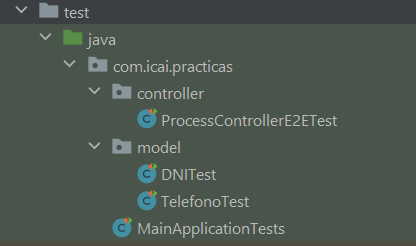
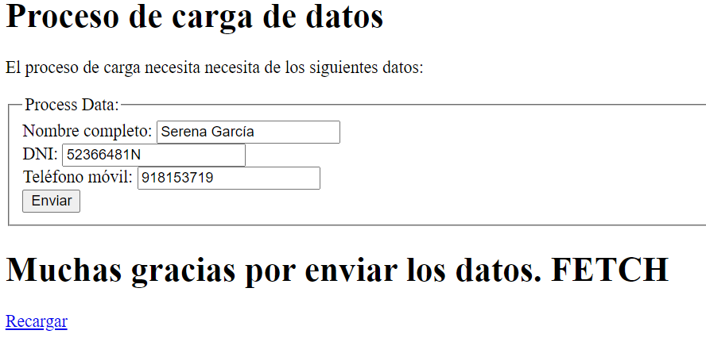
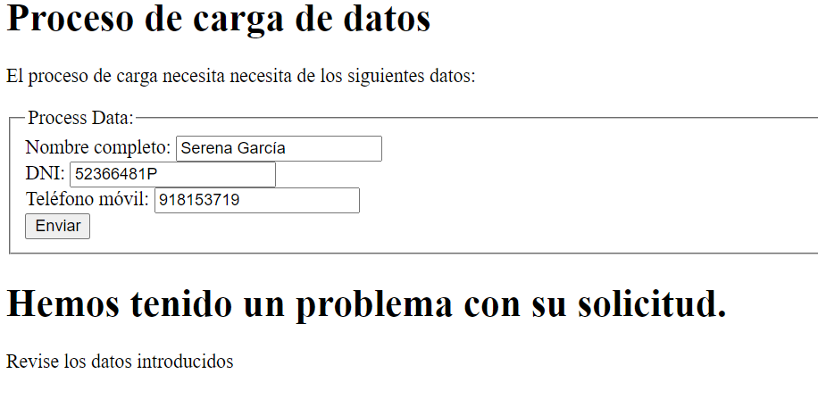

# Practica 6: Testing de una aplicación de Spring Boot
### Claudia Blanco García 3ºA GITT

## Objetivo de la práctica

Dado un desarrollo de Spring Boot, es necesario añadir tests a las siguientes clases:

- DNI & Telefono (Unit Tests) (Cada clase tiene un método y varias casuísticas para probar)
- ProcessController (E2E Tests) (2 endpoints)

```
mvn clean spring-boot:run

curl -v -X POST http://localhost:8080/api/v1/process-step1-legacy \
   -H "Content-Type: application/x-www-form-urlencoded" \
   -d "fullName=Juan%20Antonio%20Brena%20Moral&dni=12345678Z&telefono=%2B34%20600903434"

curl -v -X POST http://localhost:8080/api/v1/process-step1 \
   -H 'Content-Type: application/json' \
   -d '{"fullName":"Juan Antonio Brena Moral","dni":"12345678Z", "telefono":"+34 600903434"}'
```

## Desarrollo

### Pruebas Unitarias (Unit Tests)
Se han realizado las pruebas unitarias de las clases DNI y Telefono proporcionadas para la práctica.
Se han usado las anotaciones @SpringBootTest(classes=DNITest.class) y @SpringBootTest(classes=TelefonoTest.class) para que los tests funcionen correctamente.
Esto es necesario por la estructura de paquetes, que se muestra a continuación:


#### DNITest
Esta clase comprueba que la función "validar" de la clase DNI devuelva correctamente true/false según si un DNI dado es válido o no.
Los tres casos que se prueban son:
- DNI correcto (sigue el patrón, no es inválido...)
- DNI inválido incluido en el array {"00000000T", "00000001R", "99999999R"}
- DNI inválido porque no sigue el patrón de 8 dígitos numéricos y 1 letra. La función "validar" de la clase DNI usa, para este caso, una Regular Expression
- DNI inválido porque al dividir el número de DNI entre 23, el resto no coincide con el índice de la letra del DNI en la cadena "TRWAGMYFPDXBNJZSQVHLCKE"

#### TelefonoTest
Esta clase comprueba que la función "validar" de la clase Telefono devuelva correctamente true/false según si un teléfono dado es válido o no.
Los dos casos que se prueban son:
- Teléfono válido (sigue el patrón de 9 dígitos numéricos)
- Teléfono no válido porque no sigue el patrón: un carácter no numérico, por ejemplo

### Pruebas E2E

#### ProcessControllerTest
Esta clase comprueba que el proceso E2E de Process Controller funciona como debe. 
Se puede resumir esta comprobación en cuatro partes:
- Procesamiento de la petición en el endpoint process step 1 con credenciales correctas
- Procesamiento de la petición en el endpoint process step 1 legacy con credenciales correctas
- Procesamiento de la petición en el endpoint process step 1 con credenciales incorrectas
- Procesamiento de la petición en el endpoint process step 1 legacy con credenciales incorrectas
En cada par de casos (credenciales correctas y credenciales incorrectas) se comprueba que:
- El resultado que devuelve el paso 1 es OK/KO
- La Response Entity devuelve "Muchas gracias por enviar los datos" o "Hemos tenido un problema con su solicitud"

A continuación se muestran dos ejemplos de implementación de la práctica:

Credenciales correctas:


Credenciales incorrectas (DNI no válido):



El link a través de GitPod es:
[](https://gitpod.io/#https://github.com/201905597/practica-6-test)
